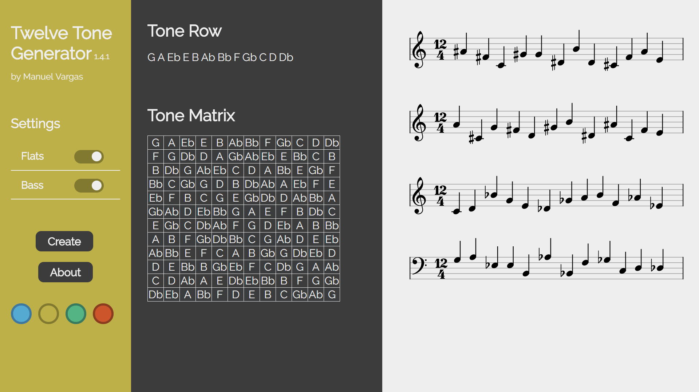

# [Twelve Tone](https://en.wikipedia.org/wiki/Twelve-tone_technique#Tone_row) Generator

[View Demo](http://mnl.space/Twelve-Tone-Generator/)

This web application creates a random twelve tone row, it's matrix, and staff notation. I wanted to see how well [Automatic Semicolon Insertion](https://www.ecma-international.org/ecma-262/7.0/index.html#sec-rules-of-automatic-semicolon-insertion) works so this entire project tries to be semicolon free.

Twelve tone music is music composed using all twelve notes of the musical alphabet equally. You create compositions by creating your own arrangement of the twelve notes called a [tone row](https://en.wikipedia.org/wiki/Tone_row) and creating [transformations](https://en.wikipedia.org/wiki/Transformation_(music)) which are then placed in a matrix. You then are free to write your composition based on the matrix. When I was in high school music theory class we had to create our matrix by hand so I thought it'd be nice to have an interface that did all the work.

Some notable examples:

* [Bill Evans](https://www.youtube.com/watch?v=eT5ymwGHeHQ)

* [Arnold Schoenberg](https://www.youtube.com/watch?v=JEY9lmCZbIc)

And my own [composition](https://www.youtube.com/watch?v=PlvMd-R_k5c) (not so notable)

Special thanks to [Luke Garrison](https://github.com/lag0215) for the themes.



## [Changelog](https://github.com/ManuelVargas1251/Twelve-Tone-Generator/blob/master/changelog.md)
The format is based on [Keep a Changelog](http://keepachangelog.com/)
and this project adheres to [Semantic Versioning](http://semver.org/).

## Note

The notation software used, Vexflow, doesn't have a built in way to pass a **`''`** as a valid "none" accidental so I built this function to be able to loop more efficiently.

```javascript
//creating notes array for note objects to be pushed
let notes = []

tone_row.forEach(function(tone){

	//if note has either accidental, pass object with modifier
	if(tone[1] == '#' || tone[1] == 'b' ){

		//push alll that to notes[th]
		notes.push(new VF.StaveNote({
			clef: clef,
			keys: [note_format(tone[0], clef)],          //vexflow keys given by note_format()
			duration: "q"                                //quarter, whole, half
		}).addAccidental(0, new VF.Accidental(tone[1])))     //adds 'accidental' modifier with '#' or 'b'
	}

	//if note has no accidental, pass object without accidental modifier
	else if(tone[1] == undefined){
	
		//push alll that to notes[th]
		notes.push(new VF.StaveNote({
			clef: clef,
			keys: [note_format(tone[0], clef)],
			duration: "q"
		}))
	}
})
```

## References
Using [Vexflow](https://github.com/0xfe/vexflow), [this instruction set to create a twelve tone matrix](http://unitus.org/FULL/12tone.pdf), [Wikipedia](https://en.wikipedia.org/wiki/Twelve-tone_technique), [jQuery](https://jquery.com/), [Hover.css](http://ianlunn.github.io/Hover/), [Animate.css](https://daneden.github.io/animate.css/).
