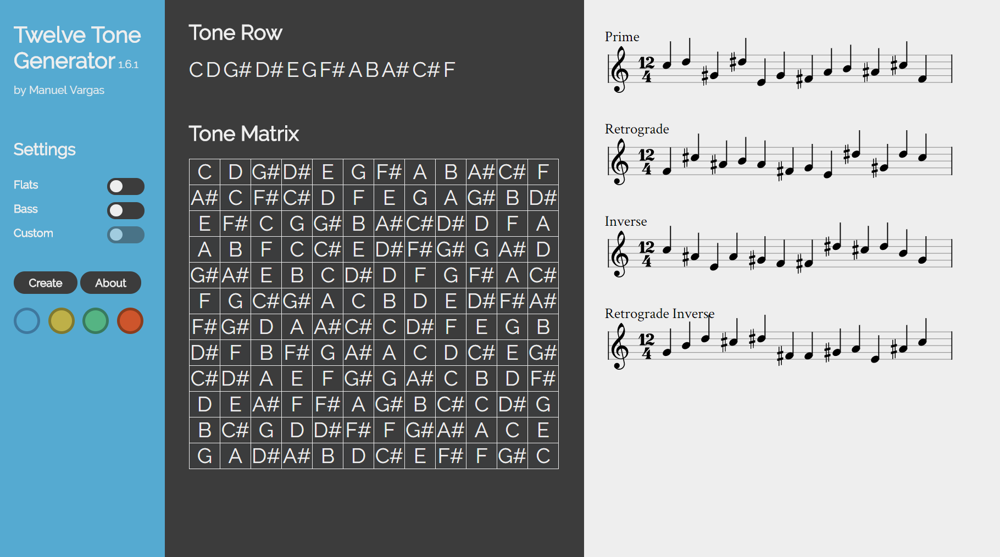

# [Twelve Tone](https://en.wikipedia.org/wiki/Twelve-tone_technique#Tone_row) Generator
This web application creates a random twelve tone row, it's matrix, and staff notation. I plan to add sound soon.

Themes by [Luke Garrison](https://github.com/lag0215)

## [Demo](http://manuelvargas.me/Twelve-Tone-Generator/)



## [Changelog](https://github.com/ManuelVargas1251/Twelve-Tone-Generator/blob/master/changelog.md)
The format is based on [Keep a Changelog](http://keepachangelog.com/)
and this project adheres to [Semantic Versioning](http://semver.org/).

## Issues
* [Vexflow](https://github.com/0xfe/vexflow) doesn't have a clear way to write over it's own canvas. I created an [issue](https://github.com/0xfe/vexflow/issues/546) with them and they seem just as interested as I am about it.

* need a way to make inputting notes look clean and fit in the current design

* [Fixed] Cannot push note objects to Vexflow vector with and without 'accidental' modifier (not all the notes will have accidentals). If there was a way to pass the object with a null value then I could just loop with the 'accidental' modifier object. After an unsuccesful [pull request](https://github.com/0xfe/vexflow/pull/543#issuecomment-296598084), I fixed it with a workaround by testing each incoming note to see if it had an accidental and pushing a different object to the vector for natural and accidental note:

```javascript
_tone_row.forEach(function(element){

	//if note has either accidental, pass object with modifier
	if(_tone_row[i][1] == '#' || _tone_row[i][1] == 'b' ){
		//push note object with accidental modifier
		notes.push(new VF.StaveNote({
			clef: clef,	//clef variable calculated above
			keys: [note_format(_tone_row[i][0], clef)],	//correct note format
			duration: "q"	//quarter notes
		}).addAccidental(0, new VF.Accidental(_tone_row[i][1])))
		//adds 'accidental' modifier
	}

	//if note has no accidental, pass object without accidental modifier
	if(_tone_row[i][1] == undefined){
		notes.push(new VF.StaveNote({
			clef: clef, 
			keys: [note_format(_tone_row[i][0], clef)],
			duration: "q"
		}))
	}
	i++
})
```

## References 
* [Vexflow](https://github.com/0xfe/vexflow)

* [Creating a Twelve Tone Matrix](http://unitus.org/FULL/12tone.pdf)

* [jQuery](https://jquery.com/)

* [Hover.css](http://ianlunn.github.io/Hover/)

* [Animate.css](https://daneden.github.io/animate.css/)


